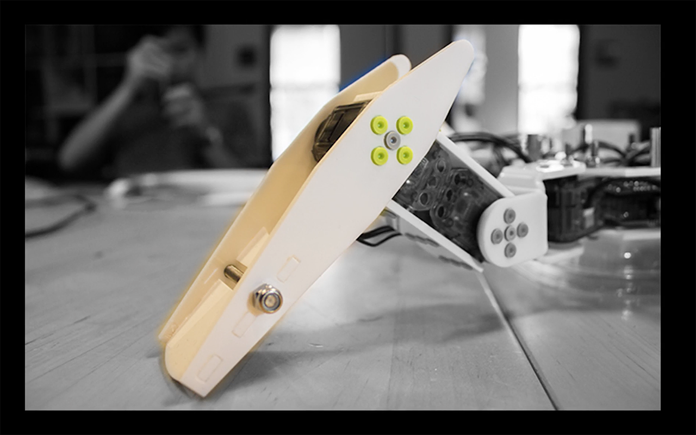
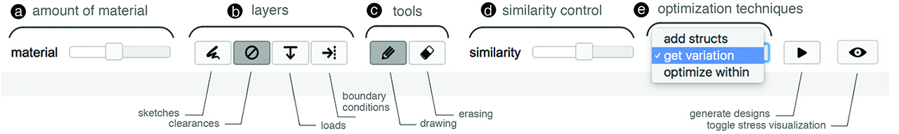
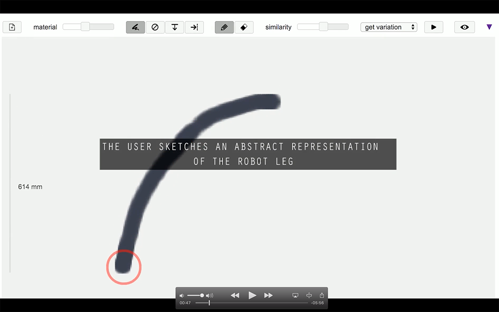
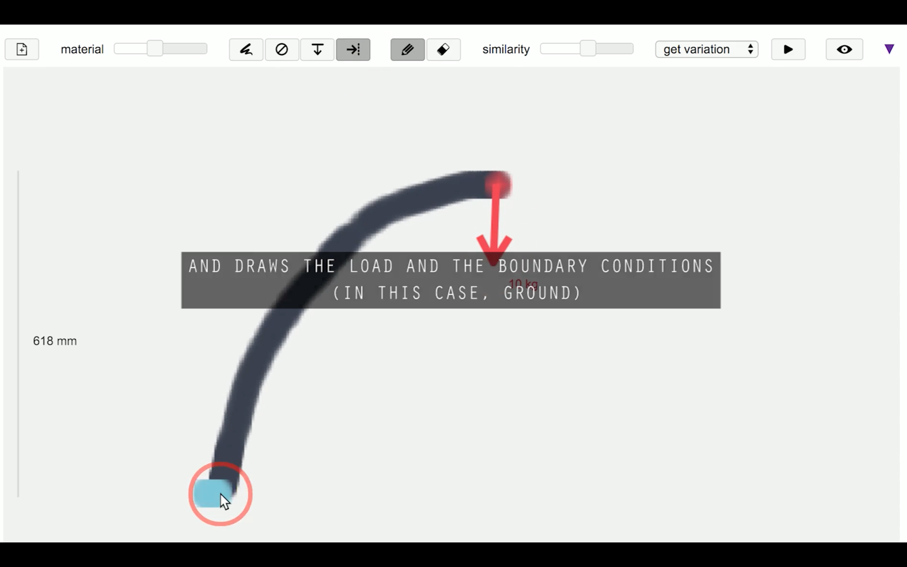
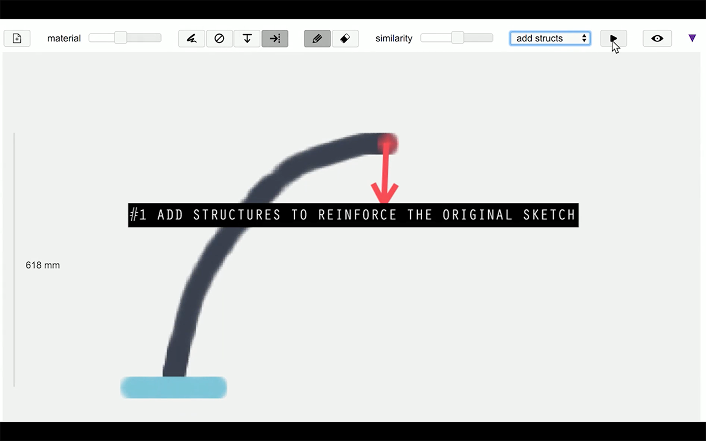

# Forté: User-Driven Generative Design
## Caveat
The current version is limited to a few platforms. Let me know if you'd like to run Forté on something different.
* The MATLAB setup is specific for Mac OS.
* The client-server communication currently is set up for Google Chrome only.

## Prerequisites Installation
* Install the **R2016b(9.1)** [MATLAB runtime](https://www.mathworks.com/products/compiler/matlab-runtime.html) to run compiled MATLAB application for topology optimization.
* Install [Python](https://www.python.org/downloads/) if you haven't.


## Running Forté
1. Open Terminal, navigate to Forté's directory.
```shell
cd forte-master
```

2. Start Forté backend.
```shell
./run_forte.sh
```

3. Open another Terminal window or tab, navigate to Forté's directory, and start a local server for Forté front end.
```shell
./serverup.py 8888
```

4. Start Chrome with flags to enable client-server communication.
```shell
./chrome.py
```

5. In Chrome, navigate to http://127.0.0.1:8888/. Voilà!

## Hello World
Let's get you started with Forté by redesigning this leg for a quadruped robot.



Forté's tool bar, just for future reference.



You start by drawing this curve, which represents how you want the new robot leg to look like.



You then draw the load (the weight of the robot's body) in red arrow, and the boundary condition (the ground where the leg stands) in blue.



Then hit the ▶ button to play with different techniques you can select from the dropdown list.



## Resources
To learn more about Project Forté, please visit the [project page](http://web.xiangchen.me/#forteacute).

## To Add
- why you want to use forte
- a preview video (1min)
- banner image
- mit licence
